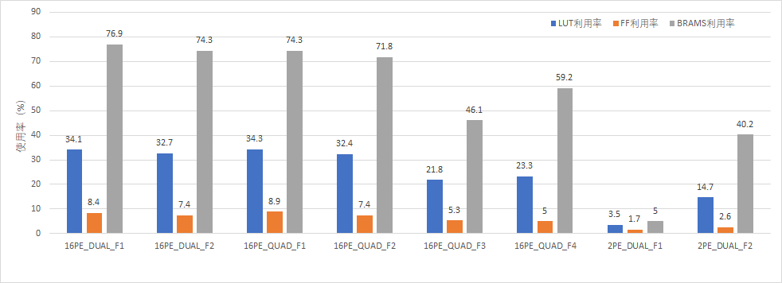

## 1. 前言
在最近的验证GPDPU的项目中，使用S2C平台分割网表后，分散到6颗VU440上实现，实现后有一定的时序问题，但不是很严重，下到板子上运行，芯片功能无法正常工作。因为芯片规模比较大，之前将芯片的一部分放到HAPS平台上可以运行，现在S2C平台有问题无法运行。本文分析分割导致资源量使用不同的情况下，资源使用量对时序的影响问题。

## 2. 各个FPGA的资源使用量与时序
### 2.1 16PE各个FPGA资源消耗量与时序

在16PE中，DPU的PCIE和DDR4均分布在QUAD_F4上，PE的时钟为1MHz。

|FPGA       |WNS     | TNS      |WHS    |THS   |TPWS     |Total Power |LUT     |FF      |BRAMS    |URAM  | DSP |IO  |BUFG  |PLL  |
|--         |--      |  --      |--     |--    |--       |--          |--      |--      |--       |--    |--   |--  |--    |--   |
|DUAL_F1    |-6.582  | -15.876  |0.030  |0.000 |-29.464  |4.867       |866077  |429902  |1938.00  |0     |0    |393 |5     |1    |
|DUAL_F2    |-6.054  | -17.861  |0.030  |0.000 |-31.891  |5.144       |828734  |376799  |1874.00  |0     |0    |444 |5     |1    |
|QUAD_F1    |-9.087  | -27.035  |0.030  |0.000 |-29.421  |5.230       |871075  |453032  |1874.00  |0     |0    |455 |5     |1    |
|QUAD_F2    |-4.282  | -12.179  |0.030  |0.000 |-24.238  |4.840       |821222  |376430  |1810.00  |0     |0    |384 |5     |1    |
|QUAD_F3    |-6.303  | -28.991  |0.030  |0.000 |-25.930  |4.784       |553834  |270067  |1164.00  |0     |0    |379 |5     |1    |
|QUAD_F4    |-0.437  | -18.846  |0.029  |0.000 |-11.285  |7.263       |590453  |258135  |1494.00  |0     |3    |455 |16    |4    |

### 2.2 2PE FPGA资源消耗量与时序

在2PE中，DPU的PCIE和DDR4均分布在DUAL_F2上，PE的时钟为5MHz。

|FPGA       |WNS     | TNS      |WHS    |THS   |TPWS     |Total Power |LUT     |FF      |BRAMS    |URAM  | DSP |IO  |BUFG  |PLL  |
|--         |--      |  --      |--     |--    |--       |--          |--      |--      |--       |--    |--   |--  |--    |--   |
|DUAL_F1    |-0.811  | -80.455  |0.004  |0.000 |-7.851   |7.541       |89932   |90504   |127.00   |0     |3    |261 |25    |4    |
|DUAL_F2    |0.402   | 0.000    |0.030  |0.000 |-4.004   |15.744      |374814  |132193  |1014.00  |0     |0    |130 |4     |1    |

### 2.3 分析
1. 2.2中DUAL_F2的功耗在15.744W，明显高于其他的FPGA的PE，猜测是因为频率为5MHz导致；
2. 资源消耗量比较如下图所示，可以得出LUT和FF利用率在合理范围。BRAM在16PE中大多在70%以上，对于BRAM资源来说，也不算太大。
   
3. 时序关系与本次设计的利用率没有显著正相关关系，可以忽略资源利用率的影响；
4. 在都是PE的设计中，2PE_DUAL_F2的时序没有问题，而16PE中PE的FPGA存在一定的问题，这个部分有一定的优化空间。

## 3. 总结
通过以上分析，资源使用量与时序之间没有太大的关系。FPGA中时序问题可能是导致工程没有正确运行的的原因，针对这一问题，对相关时钟域进行约束优化。

